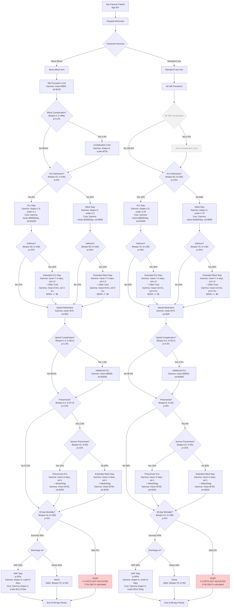

```mermaid
graph TD
    classDef inactive fill:#f2f2f2,stroke:#bdbdbd,color:#8a8a8a;

    Start["Hip Fracture Patient<br/>Age 65+"] --> Hospital["Hospital Admission"]
    Hospital --> Intervention{"Treatment Decision"}

    Intervention -->|Nerve Block| NB["Nerve Block Arm"]
    Intervention -->|Standard Care| NoNB["Standard Care Arm"]
    
    %% Nerve Block Arm
    NB --> NB_Proc["NB Procedure Cost<br/>Gamma: mean=$500, sd=$100"]
    NB_Proc --> NB_BlockComp{"Block Complication?<br/>Beta(a=4, b=996)<br/>p=0.4%"}
    NB_BlockComp -->|Yes 0.4%| NB_CompCost["Complication Cost<br/>Gamma: shape=4, scale=$750"]
    NB_BlockComp -->|No 99.6%| NB_ICU{"ICU Admission?<br/>Beta(a=16, b=184)<br/>p=8%"}
    NB_CompCost --> NB_ICU{"ICU Admission?<br/>Beta(a=16, b=184)<br/>p=8%"}
    
    NB_ICU -->|Yes 8%| NB_ICU_Stay["ICU Stay<br/>Gamma: shape=1.8, scale=1.1<br/>Cost: Gamma mean=$6000/day, sd=$1000"]
    NB_ICU -->|No 92%| NB_Ward_Stay["Ward Stay<br/>Gamma: shape=4, scale=1.5<br/>Cost: Gamma mean=$3000/day, sd=$500"]
    
    NB_ICU_Stay --> NB_Delirium_ICU{"Delirium?<br/>Beta(a=50, b=150)<br/>p=25%"}
    NB_Ward_Stay --> NB_Delirium_Ward{"Delirium?<br/>Beta(a=50, b=150)<br/>p=25%"}
    
    NB_Delirium_ICU -->|Yes 25%| NB_Del_ICU_Cost["Extended ICU Stay<br/>Gamma: mean=7.4 days, sd=1.9<br/>+ Sitter Cost<br/>Gamma: mean=8 hrs, sd=3 hrs<br/>$25/hr +/- $5"]
    NB_Delirium_ICU -->|No 75%| NB_Complications
    NB_Del_ICU_Cost --> NB_Complications
    
    NB_Delirium_Ward -->|Yes 25%| NB_Del_Ward_Cost["Extended Ward Stay<br/>Gamma: mean=7.4 days, sd=1.9<br/>+ Sitter Cost<br/>Gamma: mean=8 hrs, sd=3 hrs<br/>$25/hr +/- $5"]
    NB_Delirium_Ward -->|No 75%| NB_Complications
    NB_Del_Ward_Cost --> NB_Complications
    
    NB_Complications["Opioid Medication<br/>Gamma: mean=$75, sd=$20"] --> NB_Opioid{"Opioid Complication?<br/>Beta(a=1.5, b=98.5)<br/>p=1.5%"}
    
    NB_Opioid -->|Yes 1.5%| NB_Opioid_Cost["Additional ICU<br/>Gamma: mean=$9000, sd=$3000"]
    NB_Opioid -->|No 98.5%| NB_Pneumonia
    NB_Opioid_Cost --> NB_Pneumonia
    
    NB_Pneumonia{"Pneumonia?<br/>Beta(a=2.5, b=97.5)<br/>p=2.5%"} -->|Yes 2.5%| NB_Pneu_Severe{"Severe Pneumonia?<br/>Beta(a=15, b=85)<br/>p=15%"}
    NB_Pneumonia -->|No 97.5%| NB_Mortality
    
    NB_Pneu_Severe -->|Yes 15%| NB_Pneu_ICU["Pneumonia ICU<br/>Gamma: mean=4 days, sd=1<br/>+ Meds/Diag<br/>Gamma: mean=$750, sd=$250"]
    NB_Pneu_Severe -->|No 85%| NB_Pneu_Ward["Extended Ward Stay<br/>Gamma: mean=4 days, sd=1<br/>+ Meds/Diag<br/>Gamma: mean=$750, sd=$250"]
    
    NB_Pneu_ICU --> NB_Mortality
    NB_Pneu_Ward --> NB_Mortality
    
    NB_Mortality{"30-day Mortality?<br/>Beta(a=10, b=190)<br/>p=5%"} -->|Dies 5%| NB_Death["Death<br/>X COSTS NOT ADJUSTED<br/>X No QALYs calculated"]
    NB_Mortality -->|Survives 95%| NB_Discharge{"Discharge to?"}
    
    NB_Discharge -->|SNF 55%| NB_SNF["SNF Stay<br/>p=55%<br/>Gamma: shape=4, scale=5 days<br/>Cost: Gamma shape=4, scale=$112.5/day"]
    NB_Discharge -->|Home 45%| NB_Home["Home<br/>Utility: Beta(a=70, b=30)"]
    
    NB_SNF --> NB_End["End of 90-day Period"]
    NB_Home --> NB_End
    NB_Death --> NB_End
    
    %% Standard Care Arm
    NoNB --> NoNB_Proc["No NB Procedure"]
    NoNB_Proc --> NoNB_BlockComp{"No NB Complication"}
    NoNB_BlockComp -->|Yes 0.0%| NoNB_CompCost["Zero Complication Cost"]
    NoNB_BlockComp -->|No 100.0%| NoNB_ICU{"ICU Admission?<br/>Beta(a=16, b=184)<br/>p=8%"}
    NoNB_CompCost --> NoNB_ICU{"ICU Admission?<br/>Beta(a=20, b=180)<br/>p=10%"}    
    class NoNB_BlockComp,NoNB_CompCost inactive;

    NoNB_ICU -->|Yes 10%| NoNB_ICU_Stay["ICU Stay<br/>Gamma: shape=2.0, scale=1.25<br/>Cost: Gamma mean=$6000/day, sd=$1000"]
    NoNB_ICU -->|No 90%| NoNB_Ward_Stay["Ward Stay<br/>Gamma: shape=4, scale=1.75<br/>Cost: Gamma mean=$3000/day, sd=$500"]
    
    NoNB_ICU_Stay --> NoNB_Delirium_ICU{"Delirium?<br/>Beta(a=70, b=130)<br/>p=35%"}
    NoNB_Ward_Stay --> NoNB_Delirium_Ward{"Delirium?<br/>Beta(a=70, b=130)<br/>p=35%"}
    
    NoNB_Delirium_ICU -->|Yes 35%| NoNB_Del_ICU_Cost["Extended ICU Stay<br/>Gamma: mean=7.4 days, sd=1.9<br/>+ Sitter Cost<br/>Gamma: mean=16 hrs, sd=5 hrs<br/>$25/hr +/- $5"]
    NoNB_Delirium_ICU -->|No 65%| NoNB_Complications
    NoNB_Del_ICU_Cost --> NoNB_Complications
    
    NoNB_Delirium_Ward -->|Yes 35%| NoNB_Del_Ward_Cost["Extended Ward Stay<br/>Gamma: mean=7.4 days, sd=1.9<br/>+ Sitter Cost<br/>Gamma: mean=16 hrs, sd=5 hrs<br/>$25/hr +/- $5"]
    NoNB_Delirium_Ward -->|No 65%| NoNB_Complications
    NoNB_Del_Ward_Cost --> NoNB_Complications
    
    NoNB_Complications["Opioid Medication<br/>Gamma: mean=$75, sd=$20"] --> NoNB_Opioid{"Opioid Complication?<br/>Beta(a=4.5, b=95.5)<br/>p=4.5%"}
    
    NoNB_Opioid -->|Yes 4.5%| NoNB_Opioid_Cost["Additional ICU<br/>Gamma: mean=$9000, sd=$3000"]
    NoNB_Opioid -->|No 95.5%| NoNB_Pneumonia
    NoNB_Opioid_Cost --> NoNB_Pneumonia
    
    NoNB_Pneumonia{"Pneumonia?<br/>Beta(a=6, b=94)<br/>p=6%"} -->|Yes 6%| NoNB_Pneu_Severe{"Severe Pneumonia?<br/>Beta(a=15, b=85)<br/>p=15%"}
    NoNB_Pneumonia -->|No 94%| NoNB_Mortality
    
    NoNB_Pneu_Severe -->|Yes 15%| NoNB_Pneu_ICU["Pneumonia ICU<br/>Gamma: mean=4 days, sd=1<br/>+ Meds/Diag<br/>Gamma: mean=$750, sd=$250"]
    NoNB_Pneu_Severe -->|No 85%| NoNB_Pneu_Ward["Extended Ward Stay<br/>Gamma: mean=4 days, sd=1<br/>+ Meds/Diag<br/>Gamma: mean=$750, sd=$250"]
    
    NoNB_Pneu_ICU --> NoNB_Mortality
    NoNB_Pneu_Ward --> NoNB_Mortality
    
    NoNB_Mortality{"30-day Mortality?<br/>Beta(a=12, b=188)<br/>p=6%"} -->|Dies 6%| NoNB_Death["Death<br/>X COSTS NOT ADJUSTED<br/>X No QALYs calculated"]
    NoNB_Mortality -->|Survives 94%| NoNB_Discharge{"Discharge to?"}
    
    NoNB_Discharge -->|SNF 60%| NoNB_SNF["SNF Stay<br/>p=60%<br/>Gamma: shape=4, scale=6 days<br/>Cost: Gamma shape=4, scale=$112.5/day"]
    NoNB_Discharge -->|Home 40%| NoNB_Home["Home<br/>Utility: Beta(a=70, b=30)"]
    
    NoNB_SNF --> NoNB_End["End of 90-day Period"]
    NoNB_Home --> NoNB_End
    NoNB_Death --> NoNB_End
    
    style NB_Death fill:#ffcccc
    style NoNB_Death fill:#ffcccc

```
